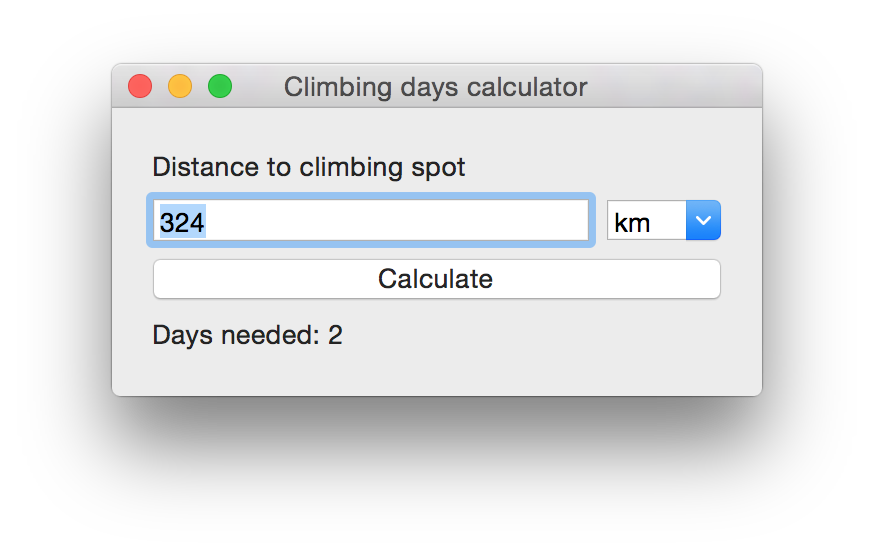

# Climbing Trip Calculator

Climbing trip calculator calculates days needed for climbing trips - based on driving distanice.
Calculator uses Dennis Hornings [floor equation (Climbing Days Per Mile)](http://www.climbing.com/blog/climbing-trip-worth-drive-math/) method described in [Climbing magazine](http://www.climbing.com/blog/climbing-trip-worth-drive-math/).

This thing was made just for fun. ;)

- Oto Brglez, March 2015
